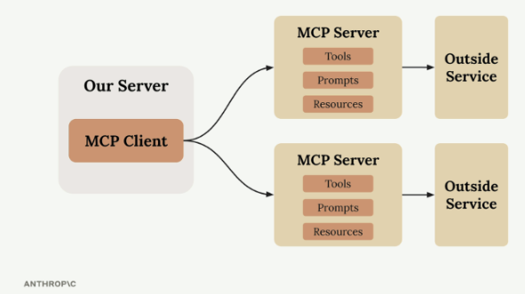
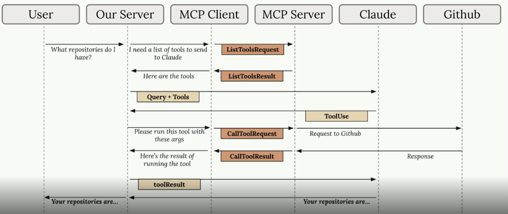
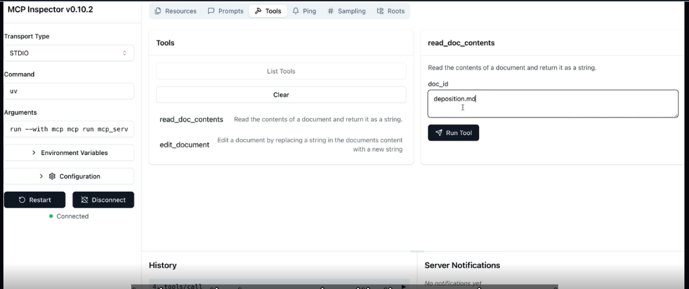
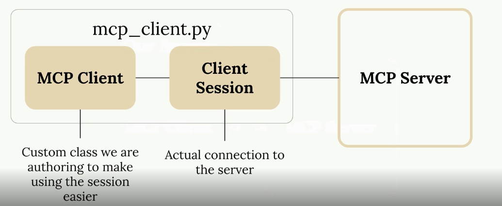

# Introduction to Model Context Protocol

MCP (Model Context Protocol) is indeed a protocol that enables clients to connect to servers that host three main primitives: tools, prompts, resources.

### 1. Tools

  - Functions that the AI model (like Claude)
   can call to perform actions
  - Model-controlled - Claude decides when to
   use them
  - Examples: database queries, file
  operations, API calls

### 2. Prompts

  - Pre-written, optimized instructions for
  specific tasks
  - User-controlled - triggered by user
  actions or commands
  - Examples: formatting templates, query
  optimization prompts

### 3. Resources

  - Data endpoints that expose information
  for read operations
  - Application-controlled - the app decides
  when to fetch data
  - Examples: schema information, document
  listings, configuration data

## Hands-on with MCP servers

- Client must pair Server.
- Server access resources, not CLAUDE.
- Claude use tools , and reply queries.

### The server Inspector

Allow debug without write full app during development.

Bash$ mcp dev mcp_server.py 

## Connecting with MCP clients

### Implementing a client  

### Defining resources  

### Accessing resources  

### Defining prompts  

### Prompts in the client

